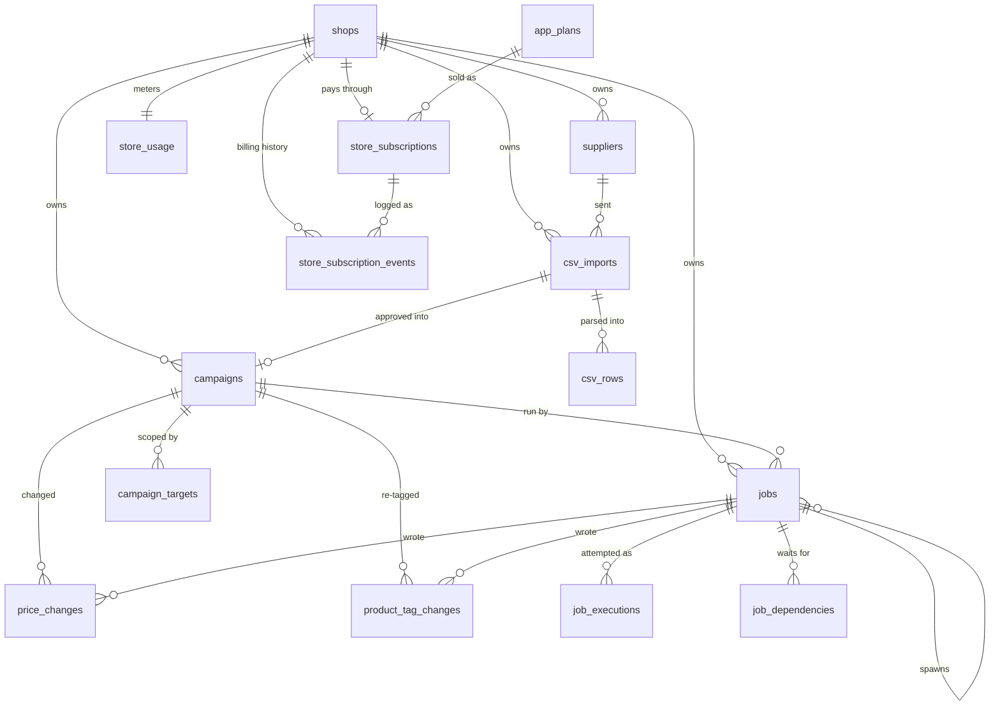
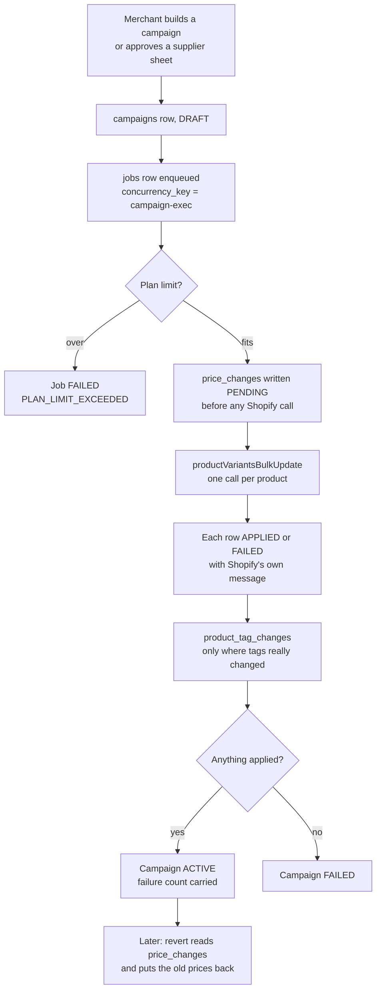

# PriceLogic — Database Map

> The schema as it actually stands, read from a live database on 2026-08-14.
> **Supersedes `07-database.md`**, which describes the 17-table design the
> 2026-08-12 re-baseline replaced.

Fifteen tables in five groups. Every one exists because something reads it —
there are no "might be useful later" columns here.

---

## The map



Two things that diagram will not tell you, and both matter more than the
arrows:

1. **Every child foreign key names two columns**, not one:
   `(shop_id, campaign_id) → campaigns(shop_id, id)`. A row in one shop
   referencing a row in another is not "prevented by a check" — it is
   *unrepresentable*.
2. **There is no product table.** Shopify owns the catalog. What we store are
   Shopify's ids as plain strings, with no foreign key, because there is
   nothing on our side to point at.

---

## How a campaign actually runs



The shape of that diagram is the whole design. **`price_changes` rows are
written before Shopify is called**, because the Shopify write cannot join a
database transaction — a crash between the two has to leave a recoverable
record rather than an untracked mutation on a live storefront.

---

## Group 1 — Tenancy

### `shops` (14 columns)

The tenant root. Everything else carries `shop_id` back to it.

Holds `access_token_encrypted` (AES-256-GCM ciphertext, never a raw token),
the merchant's `duplicate_policy` for overlapping campaigns, and two nullable
plan-limit overrides. Those overrides mean **"use the plan's own limit"** when
null — *not* unlimited. Unlimited is a null limit on the plan itself. The
distinction is what makes it safe to leave them null by default.

Sessions are JWTs, so there is deliberately no session table.

---

## Group 2 — Campaigns

### `campaigns` (26 columns)

The container every price change belongs to.

**There is no `campaign_type` column, and that is the central design decision.**
"Increase" and "decrease" are a *direction*; a supplier sheet is a *source*.
They are independent axes, and keeping them separate is what makes this work:

| Source | Adjustment | What the merchant gets |
| --- | --- | --- |
| Current price | +10% | A price rise |
| Current price | −20% | A sale |
| Supplier sheet | none | The supplier's prices as-is |
| Supplier sheet | +15% | The supplier's price **plus the merchant's markup** |

That last row is the one a `campaign_type` enum cannot express.

Also here: `round_to` (null means the merchant turned rounding *off* — it is
the switch, not a missing value), `round_strategy`, `set_compare_at`, the
include/exclude flags, tag arrays, and a schedule with **IANA zone names**
rather than offsets, so "9am local" survives a daylight-saving boundary.

### `campaign_targets` (7 columns)

Include and exclude rows. Six target types — product, variant, collection,
tag, vendor, product type — on **both** sides.

Targeting is a *set*, not a single scope. A campaign covers all products or a
list of INCLUDE rows, and independently carries any number of EXCLUDE rows,
which is what makes "everything except this vendor" directly expressible.
Exclusions always win.

`VARIANT` on the exclude side exists for "this whole collection except the
extra-large" — a request that simply cannot be written at product granularity.

### `price_changes` (19 columns)

What we changed on one variant, and what to put back.

Deliberately self-contained: revert reads **one row** and writes `old_price`
and `old_compare_at_price` back to Shopify. No join, no snapshot table.
Restoring *both* columns is what lets a product that was already on sale get
its earlier sale price back rather than its full price.

Uniqueness is `(job_id, shopify_variant_id)` — **not** `(campaign_id, …)`.
That distinction fixed a real bug: keyed on the campaign, a campaign could
hold exactly one row per variant *forever*, so a second activation had to
overwrite the first run's `old_price` and destroy the price revert needed.
Keyed on the execution, the runs accumulate.

### `product_tag_changes` (13 columns)

The tag mutation a campaign actually performed, as complete before/after sets.

A row exists **only when the tag set genuinely changed**. If a product already
carried a tag the campaign wanted to add, nothing is written — so deactivation
never strips a tag the merchant set themselves. This is the constitution's
rule in table form: *never reverse a side effect from configuration; reverse
it from a record of what was actually done.*

Keyed on a product rather than a variant, because Shopify tags are
product-level while prices are variant-level.

---

## Group 3 — Supplier sheets

### `suppliers` (8 columns)

Identity only — name, code, status. No costs, no integrations. Soft-deleted,
because `csv_imports` references it and "where did this price come from?" has
to stay answerable.

### `csv_imports` (12 columns) · `csv_rows` (18 columns)

Staging, not a durable parent. Approving an import **creates a campaign**, and
from that point the campaign owns the outcome — `price_changes` never points
at an import.

`csv_rows` carries the three numbers the approval screen shows side by side:

| Column | Meaning |
| --- | --- |
| `current_price` | What the merchant charges now, from Shopify |
| `sheet_price` | What the supplier sent |
| `approved_price` | What it becomes — pre-filled, editable |

**The sheet carries final prices, not costs.** There is no margin calculation
anywhere; `sheet_price` is the base and the campaign's adjustment applies on
top.

`excluded` lets a merchant drop a row without deleting the record, and
`raw_data jsonb` keeps the original line for the support conversation that
happens three weeks later.

---

## Group 4 — Job execution

### `jobs` (28 columns) · `job_executions` (14) · `job_dependencies` (4)

**A job is the intent; an execution is one attempt at it.** One job has many
executions, which is what keeps a retried job legible instead of overwriting
its own history. A superseded execution is marked `obsolete` and kept, because
it is the only record of what already reached Shopify.

Postgres *is* the queue — `next_run_at` + `locked_at` +
`SELECT … FOR UPDATE SKIP LOCKED`. No Redis. When a broker arrives it replaces
the dispatcher and nothing else; the rows stay the source of truth.

Dependencies are **job → job, never campaign → campaign**. Ordering is a
property of an execution, not of configuration. A dependent is released when
its dependency reaches *any* terminal state — succeeded **or** failed — because
the purpose is ordering, not success-gating. A failed first edit must not
strand the second one forever.

The join table exists rather than an array column because the dispatcher's hot
question is "what does finishing this job release?", which needs an index on
the *second* column.

---

## Group 5 — Billing

### `app_plans` (12 columns)

The only table here that is **not shop-scoped** — it is catalogue data we own,
seeded by the migration:

| Plan | Price | Variants on sale | Active campaigns |
| --- | --- | --- | --- |
| Free | $0 | 50 | 1 |
| Starter | $7.99 | 2,000 | 10 |
| Plus | $12.99 | 20,000 | 30 |
| Professional | $29.99 | unlimited | unlimited |

Limits live in the database rather than in code because prices change for
commercial reasons that should not need a deploy, and a per-shop override
cannot be a constant.

**The quota is a concurrent ceiling, not metered usage.** "Variants on sale"
means variants affected by a campaign active *right now* — a merchant who runs
and reverts a 40-variant campaign ten times has used 40 of their quota, not
400. The count is shop-wide and deduplicated: two 30-variant campaigns break a
50-variant plan even though neither does alone.

### `store_subscriptions` (13) · `store_subscription_events` (8) · `store_usage` (5)

The subscription row holds the present. Events are **append-only** — there is
no `updated_at` on that table, on purpose, because a row that can be edited is
not an audit trail and merchants dispute charges.

`store_usage` is a **cache for the meter in the UI, not the enforcement
source**. `last_reconciled_at` is the admission that a denormalized counter
always drifts; the quota check at activation recomputes from `price_changes`,
because a stale number there is a refund rather than a slow page.

---

## Three rules the database enforces itself

### 1. Cross-tenant references are unrepresentable

Every parent carries a redundant `UNIQUE (shop_id, id)`, and every child names
both columns in its foreign key:

```sql
ALTER TABLE price_changes
  ADD CONSTRAINT FK_price_changes_campaign_shop
  FOREIGN KEY (shop_id, campaign_id) REFERENCES campaigns(shop_id, id);
```

A forgotten `WHERE shop_id = …` becomes a leaked *read*, which the
`TenantScopedRepository` guards. A leaked *write* is impossible regardless of
what the application does.

`ON DELETE RESTRICT` almost everywhere. CASCADE only for `campaign_targets`,
`csv_rows`, `job_executions` and `job_dependencies` — pure configuration and
staging, meaningless without their parent.

### 2. Two partial unique indexes carry real guarantees

```sql
CREATE UNIQUE INDEX UQ_jobs_running_concurrency_key
  ON jobs (shop_id, concurrency_key)
  WHERE status = 'RUNNING' AND concurrency_key IS NOT NULL;
```

Campaign start and end run **one at a time per shop**. This is also what makes
the plan-limit check race-free — two activations cannot both pass the quota
check and then both apply. It is per *shop*: one merchant never blocks another.

```sql
CREATE UNIQUE INDEX UQ_jobs_live_dedup_key
  ON jobs (shop_id, dedup_key)
  WHERE dedup_key IS NOT NULL AND status IN
    ('PENDING','BLOCKED','RUNNING','WAITING_CHILDREN','PAUSED');
```

A double click, a redelivered webhook and a scheduler firing twice collapse
into one job — but only *while the job is live*, so the same work stays
legitimately repeatable tomorrow.

### 3. Eight CHECK constraints catch what the application might not

| Constraint | Stops |
| --- | --- |
| `CHK_campaigns_adjustment_group` | A half-specified adjustment — `num_nonnulls(unit, direction, value) IN (0,3)` |
| `CHK_campaigns_price_source` | A SHEET campaign with no import attached |
| `CHK_campaigns_window` | A campaign ending before it starts |
| `CHK_jobs_single_subject` | A job claiming both a campaign and an import |
| `CHK_job_dependencies_no_self` | A job waiting for itself |
| `CHK_price_changes_positive` | A negative price reaching Shopify |
| `CHK_app_plans_limits_non_negative` | A negative plan limit |
| `CHK_store_subscriptions_trial_window` | A trial ending before it starts |

---

## What is deliberately absent

| Not here | Why |
| --- | --- |
| `products`, `variants`, `collections` | Shopify owns the catalog. Mirroring it means a sync problem, a staleness problem and a storage problem, in exchange for nothing revert needs. |
| `price_history` | `price_changes` rows are never deleted. It *is* the history. |
| `audit_logs` | Dropped in the re-baseline; the decision to reinstate is an open Phase 8 task, not an oversight. |
| Webhook idempotency | **A real gap.** Shopify redelivers aggressively and nothing currently records "delivery `abc123` already processed". One table, worth adding before the GDPR webhooks land. |
| Volume discounts, countdown timers | Post-MVP, confirmed 2026-08-14. Volume discounts are a Shopify Discount Function — a different mechanism from writing variant prices, not an extension of it. |

---

## Reading it yourself

```bash
# Every foreign key and its delete rule
psql "$DATABASE_URL" -c "\d+ price_changes"

# The partial indexes, which \d does not show clearly
psql "$DATABASE_URL" -tAc "
  SELECT indexname, indexdef FROM pg_indexes
   WHERE schemaname='public' AND indexdef LIKE '%WHERE%'"

# Every check constraint
psql "$DATABASE_URL" -tAc "
  SELECT conrelid::regclass, conname, pg_get_constraintdef(oid)
    FROM pg_constraint WHERE contype='c'
     AND connamespace='public'::regnamespace"
```

The single migration that builds all of this is
`backend/src/database/migrations/1786550000000-CampaignSupplierMvpRebaseline.ts`.
It is hand-written, not generated: `migration:generate` cannot see composite
foreign keys or partial unique indexes and would propose dropping them on every
future run.

**It drops 13 tables.** Run `SELECT count(*) FROM shops;` against any
environment before applying it.
